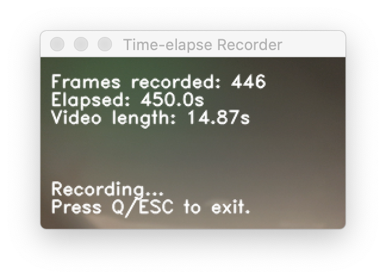

# Time-elapse Recorder: Record time elapse video with web camera!
***PENG Zhenghao***



*The interface monitoring the recording.*

**This script is tested in my mac and it works well!**

Installation and Usage:

```bash
# Install
pip install git+https://github.com/pengzhenghao/time-elapser-recorder.git

# Launch
python -m ter.run

# Launch with detail settings, see "Arguments" part below.
python -m ter.run --interval 0.5 --output-fps 30 --display-fps 20
```

Arguments:

```bash
-h, --help    Show this help message and exit
--interval    Interval between two frames, in second. Default: 1
--output-fps  The frames per second in the output video file. Default: 30
--display-fps The frames per second in display window. Default: 5
```

The output video file would be saved at the working directory with prefix `video` and format `mp4`.